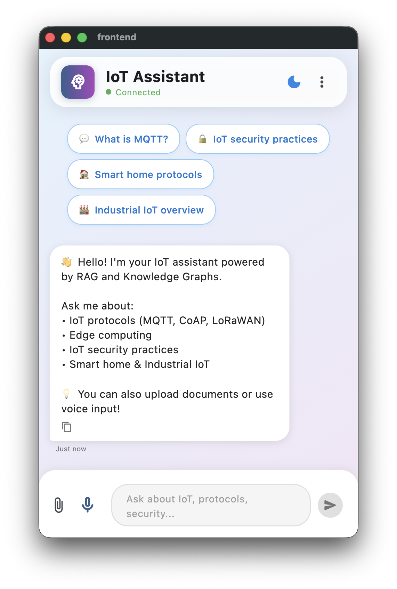
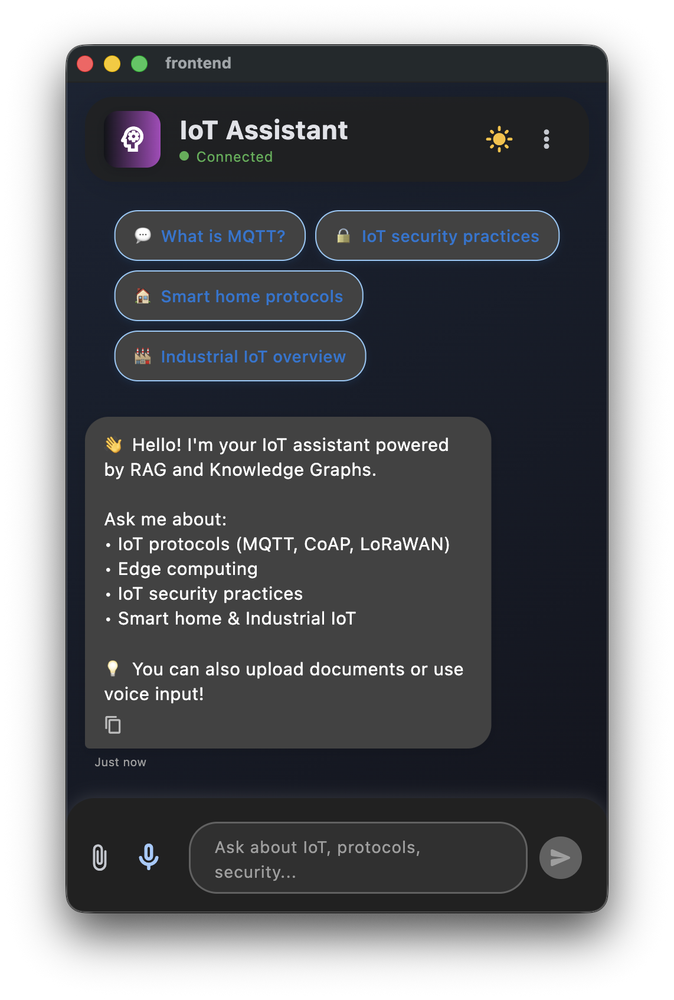

# 🤖 IoT RAG Chatbot

A production-ready AI chatbot powered by RAG (Retrieval Augmented Generation) and Knowledge Graphs, specialized in IoT and Edge Computing domains.


## ✨ Features

### 🎯 Core Capabilities
- **RAG-Powered Responses**: Retrieval Augmented Generation using ChromaDB vector store
- **Knowledge Graph Integration**: Neo4j graph database for semantic relationships
- **Local LLM**: Llama2 running via Ollama (no API costs!)
- **Conversation Memory**: Context-aware follow-up questions
- **Multi-Platform**: iOS, Android, macOS, and Web support

### 🎨 User Experience
- **📤 Document Upload**: Upload your own IoT documentation (.txt, .pdf, .md)
- **🎙️ Voice Input**: Ask questions using speech-to-text
- **💾 Chat History**: Persistent conversation storage
- **🌙 Dark Mode**: Beautiful dark/light theme with smooth transitions
- **📱 Modern UI**: Gradient designs, animations, and responsive layout
- **🔔 Notifications**: Get notified when responses are ready

### 🏗️ Architecture
- **Backend**: FastAPI + Python
- **Vector DB**: ChromaDB for semantic search
- **Graph DB**: Neo4j for knowledge relationships
- **LLM**: Ollama + Llama2 (local inference)
- **Embeddings**: sentence-transformers/all-MiniLM-L6-v2
- **Frontend**: Flutter for cross-platform mobile/desktop

## 📸 Screenshots

### Light Mode


### Dark Mode



## 🚀 Quick Start

### Prerequisites

- **macOS** (Apple Silicon M1/M2 recommended)
- **Python 3.9+**
- **Flutter 3.0+**
- **Docker Desktop**
- **Homebrew**

### 1. Clone Repository
```bash
git clone https://github.com/chikamichka/iot-rag-chatbot-app.git
cd iot-rag-chatbot
```

### 2. Backend Setup
```bash
# Navigate to backend
cd backend

# Create virtual environment
python3 -m venv venv
source venv/bin/activate

# Install dependencies
pip install -r requirements.txt

# Configure environment
cp .env.example .env
# Edit .env with your settings
```

### 3. Install Ollama & Llama2
```bash
# Install Ollama
brew install ollama

# Start Ollama service
ollama serve &

# Pull Llama2 model (3.8GB)
ollama pull llama2
```

### 4. Start Services
```bash
# Option A: Use startup script (recommended)
./start.sh

# Option B: Manual startup
# Terminal 1: Neo4j
docker run -d --name neo4j-iot -p 7474:7474 -p 7687:7687 \
  -e NEO4J_AUTH=neo4j/iot-password-2024 neo4j:5.13.0

# Terminal 2: Backend
cd backend
source venv/bin/activate
uvicorn app.main:app --reload --host 0.0.0.0 --port 8000
```

### 5. Frontend Setup
```bash
# Navigate to frontend
cd frontend

# Install dependencies
flutter pub get

# Run on desired platform
flutter run -d macos        # macOS
flutter run -d chrome       # Web
flutter run                 # Connected device (iOS/Android)
```

## 📱 Mobile Setup (iOS/Android)

### For Physical Devices

1. **Find your Mac's IP address:**
```bash
ifconfig | grep "inet " | grep -v 127.0.0.1
```

2. **Update `frontend/lib/services/api_service.dart`:**
```dart
static String get baseUrl {
  if (Platform.isAndroid) {
    return 'http://YOUR_MAC_IP:8000/api/v1';  // e.g., 192.168.1.5
  }
  // ...
}
```

3. **Ensure devices are on the same WiFi network**

4. **Run the app:**
```bash
flutter run
```

### Android Specific

Enable USB debugging on your Android device:
1. Go to Settings → About Phone
2. Tap "Build Number" 7 times
3. Go to Settings → Developer Options → Enable USB Debugging

### iOS Specific

Requires Xcode and valid Apple Developer account for physical device deployment.

## 🏗️ Project Structure
```
iot-rag-chatbot/
├── backend/
│   ├── app/
│   │   ├── api/
│   │   │   └── routes.py          # API endpoints
│   │   ├── core/
│   │   │   └── config.py          # Configuration
│   │   ├── models/
│   │   │   └── graph_models.py    # Data models
│   │   ├── services/
│   │   │   ├── rag_service.py     # RAG implementation
│   │   │   └── graph_service.py   # Neo4j operations
│   │   ├── data/
│   │   │   └── docs/              # Document storage
│   │   └── main.py                # FastAPI app
│   ├── requirements.txt
│   ├── Dockerfile
│   └── .env
├── frontend/
│   ├── lib/
│   │   ├── models/
│   │   │   └── message.dart
│   │   ├── providers/
│   │   │   └── theme_provider.dart
│   │   ├── screens/
│   │   │   └── chat_screen.dart
│   │   ├── services/
│   │   │   ├── api_service.dart
│   │   │   └── chat_history_service.dart
│   │   ├── widgets/
│   │   │   ├── message_bubble.dart
│   │   │   ├── chat_input.dart
│   │   │   └── typing_indicator.dart
│   │   └── main.dart
│   └── pubspec.yaml
├── docker-compose.yml
├── start.sh
├── stop.sh
└── README.md
```

## 🔧 Configuration

### Environment Variables

Create `backend/.env`:
```env
# Neo4j Configuration
NEO4J_URI=bolt://localhost:7687
NEO4J_USER=neo4j
NEO4J_PASSWORD=iot-password-2024

# API Configuration
API_HOST=0.0.0.0
API_PORT=8000

# Ollama Configuration
OLLAMA_HOST=http://localhost:11434

# Vector Store
CHROMA_PERSIST_DIR=./chroma_db
```

## 📚 API Documentation

Once the backend is running, visit:

- **Interactive API Docs**: http://localhost:8000/docs
- **Alternative Docs**: http://localhost:8000/redoc
- **Health Check**: http://localhost:8000/api/v1/health

### Key Endpoints

| Endpoint | Method | Description |
|----------|--------|-------------|
| `/api/v1/query` | POST | Send query with conversation history |
| `/api/v1/upload` | POST | Upload documents (.txt, .pdf, .md) |
| `/api/v1/graph/related` | POST | Get related concepts from knowledge graph |
| `/api/v1/health` | GET | Check service status |

## 🎯 Usage Examples

### Basic Query
```bash
curl -X POST "http://localhost:8000/api/v1/query" \
  -H "Content-Type: application/json" \
  -d '{
    "query": "What is MQTT?",
    "top_k": 3
  }'
```

### Upload Document
```bash
curl -X POST "http://localhost:8000/api/v1/upload" \
  -F "file=@your_document.txt"
```

### Graph Query
```bash
curl -X POST "http://localhost:8000/api/v1/graph/related" \
  -H "Content-Type: application/json" \
  -d '{
    "concept_id": "mqtt",
    "max_depth": 2
  }'
```

## 🐳 Docker Deployment

### Using Docker Compose
```bash
# Start all services
docker-compose up -d

# View logs
docker-compose logs -f

# Stop services
docker-compose down
```

### Build and Run Manually
```bash
# Build backend image
docker build -t iot-rag-backend ./backend

# Run backend container
docker run -d -p 8000:8000 \
  -e NEO4J_URI=bolt://neo4j:7687 \
  iot-rag-backend
```

## 🔒 Security Considerations

- **Production Deployment**: Change default Neo4j password
- **API Authentication**: Add JWT or OAuth for production
- **CORS**: Configure proper CORS origins in production
- **Firewall**: Restrict port access appropriately
- **HTTPS**: Use reverse proxy (nginx) with SSL certificates

## 🧪 Testing

### Backend Tests
```bash
cd backend
pytest tests/
```

### Flutter Tests
```bash
cd frontend
flutter test
```

### Integration Tests
```bash
# Test backend health
curl http://localhost:8000/api/v1/health

# Test query endpoint
curl -X POST http://localhost:8000/api/v1/query \
  -H "Content-Type: application/json" \
  -d '{"query": "test"}'
```

## 🐛 Troubleshooting

### Backend won't start
- Verify Python version: `python --version` (should be 3.9+)
- Check if ports are available: `lsof -i :8000`
- Ensure Neo4j is running: `docker ps | grep neo4j`

### Frontend build errors
- Clean build: `flutter clean && flutter pub get`
- Check Flutter version: `flutter --version`
- Verify device connection: `flutter devices`

### Connection issues (Mobile)
- Ensure same WiFi network
- Verify Mac's IP address: `ifconfig | grep inet`
- Check firewall settings
- Test from browser: `http://YOUR_MAC_IP:8000/health`

### Neo4j connection failed
```bash
# Restart Neo4j container
docker restart neo4j-iot

# Check Neo4j logs
docker logs neo4j-iot
```

## 📈 Performance

- **Response Time**: ~2-5 seconds (depending on query complexity)
- **Vector Search**: Sub-second retrieval from ChromaDB
- **LLM Inference**: Optimized for M1/M2 chips
- **Concurrent Users**: Handles 10+ simultaneous requests

## 🛣️ Roadmap

- [ ] Add more IoT protocols documentation
- [ ] Fine-tune Llama2 with LoRA for IoT-specific terminology
- [ ] Implement user authentication
- [ ] Add analytics dashboard
- [ ] Support for image-based documents (OCR)
- [ ] Multi-language support
- [ ] Export chat history as PDF
- [ ] Integration with IoT platforms (AWS IoT, Azure IoT Hub)

## 🤝 Contributing

Contributions are welcome! Please follow these steps:

1. Fork the repository
2. Create a feature branch (`git checkout -b feature/AmazingFeature`)
3. Commit your changes (`git commit -m 'Add some AmazingFeature'`)
4. Push to the branch (`git push origin feature/AmazingFeature`)
5. Open a Pull Request

## 📄 License

This project is licensed under the MIT License - see the [LICENSE](LICENSE) file for details.

## 🙏 Acknowledgments

- **LlamaIndex**: RAG framework
- **Ollama**: Local LLM inference
- **Neo4j**: Graph database
- **ChromaDB**: Vector database
- **Flutter**: Cross-platform framework
- **FastAPI**: Modern Python web framework

## 📧 Contact


Project Link: [https://github.com/chikamichka/iot-rag-chatbot-app](https://github.com/chikamichka/iot-rag-chatbot-app)
